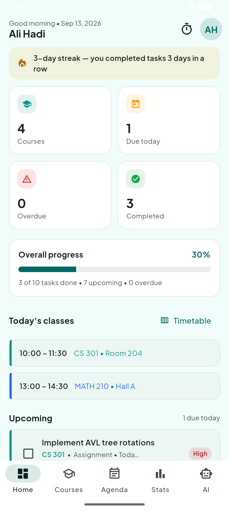
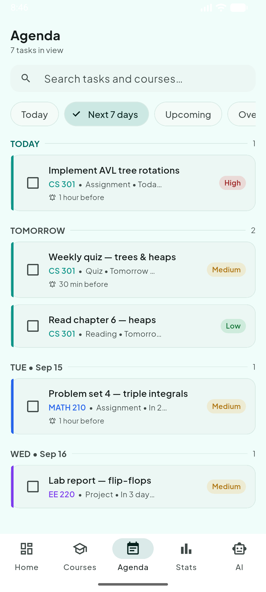
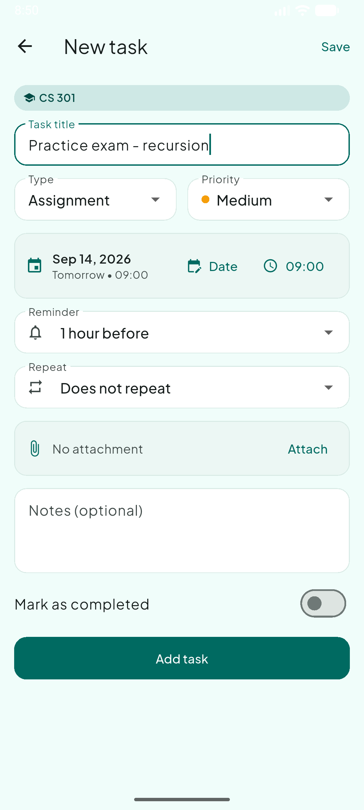
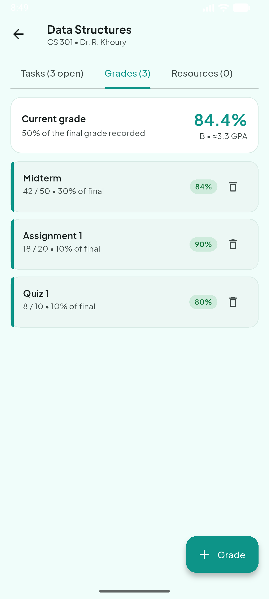
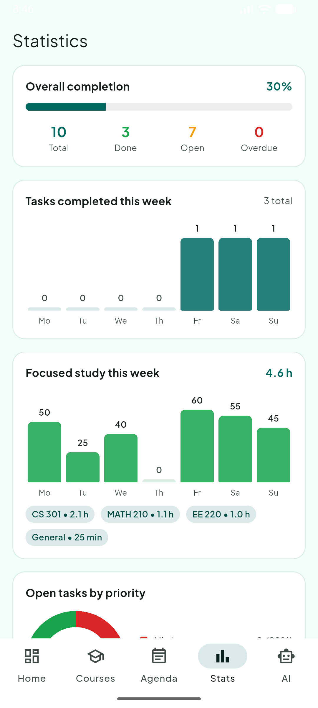
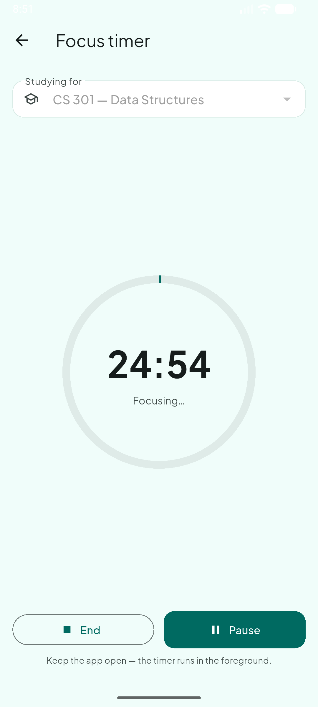
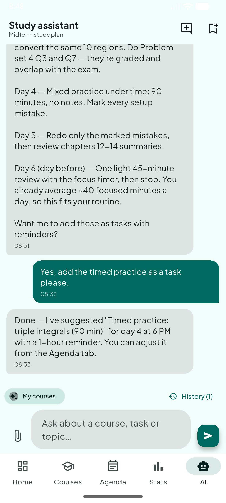

<div align="center">

# 🎓 UniMate

### Your entire semester in one app — courses, deadlines, grades, focus time and an AI study assistant.

Built with Flutter by **Ali Hadi Meselmani** and **Ali Rammal**


</div>

---

## 📖 About

**UniMate** is a study planner for university students. It keeps a whole
semester in one place: your courses, every assignment and exam, your weekly
class timetable, your grades and GPA, and how much focused study time you
actually put in — with an **AI study assistant that knows your real
workload** and can plan your week for you.

It is **offline-first**: everything lives on your device in SQLite. Nothing
leaves your phone except the messages you choose to send to the AI assistant.

## 📱 Screenshots

| Dashboard | Agenda | Task editor |
| :---: | :---: | :---: |
|  |  |  |

| Grades | Statistics | Focus timer | AI assistant |
| :---: | :---: | :---: | :---: |
|  |  |  |  |

## ✨ Features

### 📋 Coursework planning
- Colour-coded courses per semester, with instructor and code.
- Five task types — assignments, exams, quizzes, projects, readings — each
  with priority, notes, an optional file attachment, and a due date **and time**.
- **Recurring tasks** (daily / weekly / bi-weekly / monthly): completing one
  automatically spawns the next occurrence.
- Swipe right to complete, swipe left to delete — every destructive action
  has an **Undo**.

### 🗓 Weekly overview
- The **Agenda** merges every task from every course, grouped by day, with
  quick filters (today, next 7 days, upcoming, overdue) and full-text search.
- A weekly **Timetable** holds lecture and lab slots; today's classes appear
  on the dashboard every morning.
- Dashboard counters are deep links — tapping *Overdue* jumps straight to
  the overdue agenda.

### 🔔 Reminders that survive reboots
- Per-task local notifications, scheduled a chosen interval before the
  deadline, re-armed automatically after restarts and device reboots.
- Optional **daily check-in** notification at a time you pick.
- The UI refreshes itself whenever data changes — there are no refresh buttons.

### 🎯 Grades, GPA & study analytics
- Record assessment results with their **weight in the final grade**; UniMate
  shows a live weighted average, letter grade and estimated 4.0-scale GPA per
  course.
- Statistics screen: 7-day completion chart, open-tasks-by-priority donut,
  per-course progress bars and focused-study hours per course.
- A **streak banner** tracks consecutive days with completed work.
- A Pomodoro-style **focus timer** banks studied minutes per course — even if
  you stop early.

### 🤖 AI study assistant (Google Gemini)
- The chat is **grounded in your actual data**: it sees your courses, open
  tasks and class schedule, so *"what should I work on tonight?"* gets a real
  answer.
- Ask it to plan your week and it proposes concrete tasks you review in a
  checklist and **add with one tap** — parsed defensively, so malformed model
  output can never corrupt your data.
- Reads attached **images and PDFs** (slides, problem sheets, syllabi).
- Conversations can be saved, reopened and continued.

### 🔒 Privacy & data ownership
- Local accounts with **salted SHA-256 password hashing** and strict
  per-account data separation.
- Archive finished semesters without deleting anything.
- One-tap **JSON backup export/import** moves the whole account to any device.
- Light, dark and system themes; respects the system *reduce motion* setting;
  WCAG-conscious contrast throughout.

## 🛠 Tech stack

| Layer | Choice |
| --- | --- |
| Framework | Flutter (Material 3, custom teal design system, bundled Plus Jakarta Sans) |
| Language | Dart 3.9 |
| State management | Provider (auth/session, settings, tab navigation, data-refresh bus) |
| Persistence | SQLite via `sqflite` (+ `sqflite_common_ffi` on desktop), versioned migrations |
| Notifications | `flutter_local_notifications` + `timezone` (exact, reboot-safe scheduling) |
| AI | Google Gemini API (multimodal: text, images, PDFs) |
| Security | `crypto` — salted SHA-256 password hashing |
| Files & links | `file_picker`, `open_file`, `url_launcher` |

## 🏗 Architecture

```
lib/
  core/          design tokens, date helpers, password hashing
  db/            schema, migrations, one storage module per table
  models/        Course, Task, Grade, ClassSession, Resource, Chat…
  providers/     auth/session, settings, tab navigation, data refresh, Gemini client
  services/      notifications, task actions, backup, AI task parser, study context
  screens/       dashboard, courses, agenda, timetable, focus timer, stats, AI, settings
  widgets/       shared tiles, pills, charts, empty states
```

Design decisions worth noting:

- **Storage modules, not an ORM** — one small, testable module per table;
  joined queries scope every read to the signed-in account.
- **Data-refresh bus** — a single revision counter; screens re-query when it
  bumps, so the app never needs manual refresh buttons.
- **Defensive AI parsing** — task suggestions arrive in a fenced block that
  is validated field-by-field (types, priorities, date ranges) before
  anything touches the database.
- **Idempotent migrations** — every `ALTER TABLE` checks the live schema
  first, so upgrading from *any* older version is safe.

### 🗄 Database schema history

SQLite, currently at **version 5**. Upgrades run automatically on first
launch after an update, and every migration path is covered by tests.

| Version | Change |
| --- | --- |
| 1 | `courses`, `tasks`, `resources` |
| 2 | `users` |
| 3 | per-account data, salted password hashes, task notes + reminders, chat history |
| 4 | `class_sessions` + `grades`, recurring tasks, attachments, course archiving |
| 5 | `study_sessions` (focus timer) |

## 🧪 Testing

```bash
flutter test
```

**66 tests** run against a real SQLite file — not mocks:

- password hashing, model serialisation, date helpers
- grade / GPA / streak maths and the AI task-suggestion parser
- per-account scoping, task counters, cascade deletes
- recurring-task roll-over and backup round-trips
- **every schema migration path**, including regression tests for real bugs
  found on devices

## 🚀 Getting started

```bash
git clone https://github.com/AliHadi315/uniMate-Mobile-Application.git
cd uniMate-Mobile-Application
flutter pub get
```

Create the environment file (git-ignored, but declared as an asset, so it
**must exist** or the build fails):

```bash
cp .env.example .env
```

To enable the AI assistant, put a
[Google AI Studio key](https://aistudio.google.com/app/apikey) in it:

```
GEMINI_API_KEY=your-key-here
```

Leaving it empty is fine — the app runs and the AI tab explains that the key
is missing. Then:

```bash
flutter run
```

**Supported targets:** Android, iOS, Windows, macOS, Linux. Desktop builds
use `sqflite_common_ffi`, initialised automatically at start-up. Reminders
are available on Android, iOS and macOS.

## 👥 Authors

| | |
| --- | --- |
| **Ali Hadi Meselmani** | Co-creator |
| **Ali Rammal** | Co-creator |

---

<div align="center">

*Built for students who want one app instead of five.*

</div>
